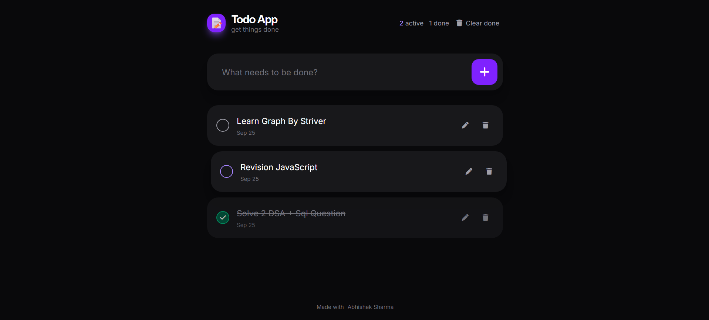

# 📝 Todo App

A simple, modern, and responsive **Todo App** built with **HTML, CSS, and JavaScript**. It helps users create, manage, edit, complete, and delete their daily tasks while automatically saving tasks in the browser's `localStorage`.

## 🚀 Live Demo

🔗 **Live Demo:** [Add your deployed URL here]

## 📸 Screenshots

### 💻 Laptop



## ✨ Features

* ➕ Add new tasks
* ✅ Mark tasks as completed
* ✏️ Edit existing tasks
* 🗑️ Delete individual tasks
* 🧹 Clear all completed tasks
* 💾 Automatically save tasks using `localStorage`
* 📊 Display active and completed task counts
* 📅 Display task creation dates
* 🔄 Automatically restore tasks after refreshing the page
* ⌨️ Keyboard shortcut `/` to focus the task input
* 🎨 Modern dark UI
* 📱 Responsive design
* 🌊 Empty-state message when there are no tasks
* ✨ Completion animation/effect

## 🛠️ Technologies Used

| Technology   | Purpose                                |
| ------------ | -------------------------------------- |
| HTML5        | Page structure and semantic markup     |
| CSS3         | Custom styling                         |
| Tailwind CSS | Utility-based UI styling               |
| JavaScript   | Application logic and DOM manipulation |
| LocalStorage | Persistent task storage                |
| Font Awesome | Icons                                  |

## 📂 Project Structure

```text
Todo-App/
│
├── .gitignore
├── .git/
│
├── Frontend/
│   ├── index.html
│   ├── package-lock.json
│   ├── package.json
│   ├── postcss.config.js
│   └── styles.css
│
├── images/
│   ├── Laptop.png
│   └── Phone.jpeg
│
└── README.md
```

## ⚙️ How It Works

### 1. Add a Task

Enter your task in the input field and click the **+** button.

You can also press **Enter** to add the task.

### 2. Complete a Task

Click the checkbox beside a task to change its completion status.
Completed tasks are visually displayed differently.

### 3. Edit a Task

Click the edit icon to modify an existing task.

### 4. Delete a Task

Click the delete icon to remove an individual task.

### 5. Clear Completed Tasks

The **Clear done** button removes every completed task after confirmation.

## 💾 LocalStorage

The application stores tasks inside the browser's `localStorage`.

### Save Tasks

```javascript
function saveTasks() {
    localStorage.setItem('tasks', JSON.stringify(tasks));
}
```

### Load Tasks

```javascript
let tasks = JSON.parse(localStorage.getItem('tasks')) || [];
```

This allows tasks to remain available even after the browser page is refreshed.

## 📊 Task Statistics

The application displays two statistics:

* **Active** — Number of incomplete tasks
* **Done** — Number of completed tasks

## ⌨️ Keyboard Shortcut

Press `/` anywhere on the page when the task input is not active to quickly focus the task input.

## 🎨 UI Design

The application uses a dark-themed interface with:

* Zinc background colors
* Violet primary action buttons
* Rounded cards
* Font Awesome icons
* Responsive layout
* Empty-state design

The main application interface contains the task input, task list, task statistics, and clear-completed action.

## 🔐 Data & Privacy

This application does not require a backend or database.
Tasks are stored locally in the user's browser using:
Therefore, tasks are specific to the browser/device where they were created.

## 🔮 Future Improvements

Possible improvements for future versions:

* 🔍 Search tasks
* 🏷️ Task categories and tags
* 📅 Due dates
* 🔔 Task reminders
* 🌙 Light/Dark theme switcher
* 📊 Productivity dashboard
* 🔐 User authentication
* ☁️ Cloud database synchronization
* 📱 PWA/mobile app support
* 🔄 Drag-and-drop task ordering

## 👨‍💻 Author

**Abhishek Sharma**

B.Tech Computer Science Engineering Student
Interested in Software Development Engineering and Web Development.

## ⭐ Support

If you find this project useful, consider giving the repository a ⭐ on GitHub.

---

### 📄 License

This project is available for educational and personal use.
